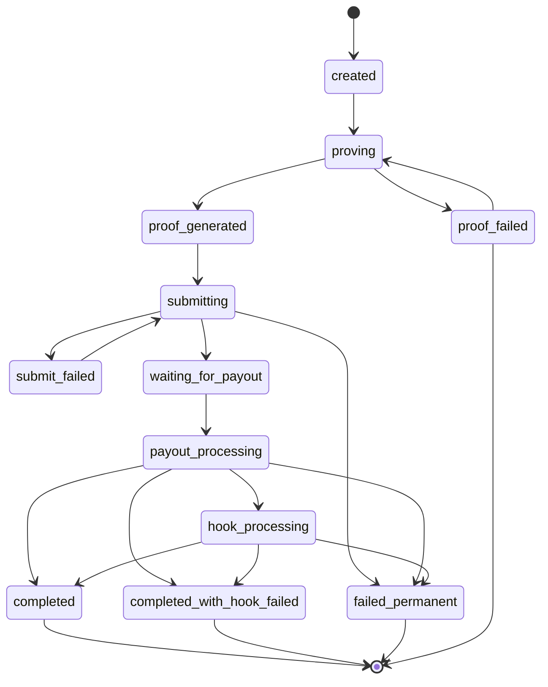

# WithdrawRequest 状态组成算法和转换说明

## 概述

WithdrawRequest 使用**主状态（Status）**和**4个子状态**的组合来跟踪提款请求的完整生命周期。主状态由子状态自动计算得出，确保状态的一致性和准确性。

## 状态结构

### 主状态（Status）

主状态是计算值，由 `UpdateMainStatus()` 函数根据子状态自动计算，不直接设置。

### 子状态（Sub-Statuses）

1. **ProofStatus** - 证明生成状态
   - `pending` - 等待生成
   - `in_progress` - 生成中
   - `completed` - 已完成
   - `failed` - 失败

2. **ExecuteStatus** - 链上验证状态
   - `pending` - 等待提交
   - `submitted` - 已提交
   - `success` - 链上确认成功
   - `submit_failed` - 提交失败（可重试）
   - `verify_failed` - 验证失败（不可重试）

3. **PayoutStatus** - 支付执行状态
   - `pending` - 等待执行
   - `processing` - 执行中
   - `completed` - 已完成
   - `failed` - 失败

4. **HookStatus** - Hook 购买状态（可选）
   - `not_required` - 不需要 Hook
   - `pending` - 等待处理
   - `processing` - 处理中
   - `completed` - 已完成
   - `failed` - 失败
   - `abandoned` - 用户放弃

## 状态计算算法

主状态的计算遵循优先级顺序，按以下规则匹配。**计算顺序很重要**：按 Stage 1 → Stage 2 → Stage 3 → Stage 4 的顺序检查，一旦匹配到条件就立即返回，不再继续检查后续阶段。

### 详细计算逻辑（按执行顺序）

#### Stage 1: Proof Generation（证明生成阶段）

**优先级最高**，优先检查证明生成状态：

1. **`proof_status == "pending"`**
   - → 主状态 = `"created"`
   - 说明：证明尚未开始生成

2. **`proof_status == "in_progress"`**
   - → 主状态 = `"proving"`
   - 说明：证明正在生成中

3. **`proof_status == "failed"`**
   - → 主状态 = `"proof_failed"`
   - 说明：证明生成失败（可重试）

4. **`proof_status == "completed" && execute_status == "pending"`**
   - → 主状态 = `"proof_generated"`
   - 说明：证明已生成完成，等待提交链上验证

**如果 Stage 1 没有匹配，继续检查 Stage 2**

#### Stage 2: On-chain Verification（链上验证阶段）

**优先检查失败状态**，再检查进行中状态：

1. **`execute_status == "verify_failed"`** ⚠️ **优先检查**
   - → 主状态 = `"failed_permanent"`
   - 说明：链上验证失败（证明无效、nullifier 已使用等），不可重试，必须取消

2. **`execute_status == "submit_failed"`**
   - → 主状态 = `"submit_failed"`
   - 说明：交易提交失败（RPC/网络错误），可重试

3. **`execute_status == "submitted"`**
   - → 主状态 = `"submitting"`
   - 说明：交易已提交，等待链上确认

4. **`execute_status == "success" && payout_status == "pending"`**
   - → 主状态 = `"waiting_for_payout"`
   - 说明：链上验证成功，等待执行支付

**如果 Stage 2 没有匹配，继续检查 Stage 3**

#### Stage 3: Intent Execution（支付执行阶段）

1. **`payout_status == "processing"`**
   - → 主状态 = `"payout_processing"`
   - 说明：支付正在执行中

2. **`payout_status == "failed"`**
   - → 主状态 = `"failed_permanent"`
   - 说明：支付执行失败，需要手动处理

**如果 Stage 3 没有匹配，继续检查 Stage 4**

#### Stage 4: Hook Purchase（Hook 购买阶段，可选）

**仅在 `payout_status == "completed"` 时检查**：

1. **`hook_status == ""`（空值）**
   - → 默认设置为 `hook_status = "not_required"`
   - 继续后续检查

2. **`hook_status == "not_required" || hook_status == "completed"`**
   - → 主状态 = `"completed"`
   - 说明：支付完成，无需 Hook 或 Hook 已完成

3. **`hook_status == "processing"`**
   - → 主状态 = `"hook_processing"`
   - 说明：Hook 购买处理中

4. **`hook_status == "failed"`**
   - 检查 `fallback_transferred`：
     - `fallback_transferred == true` → 主状态 = `"completed"`（回退转账成功）
     - `fallback_transferred == false` → 主状态 = `"failed_permanent"`（回退转账失败）

5. **`hook_status == "abandoned"`**
   - → 主状态 = `"completed_with_hook_failed"`
   - 说明：用户放弃 Hook，已提取原始代币

6. **`hook_status` 为其他未知值**
   - → 主状态 = `"completed"`（默认处理，支付已成功）

**如果所有阶段都没有匹配，保持当前主状态不变**

## 状态转换图

### ASCII 文本格式

```
┌─────────────┐
│   created   │ ← 初始状态 (proof_status=pending)
└──────┬──────┘
       │ proof_status → in_progress
       ▼
┌─────────────┐
│   proving   │ (proof_status=in_progress)
└──────┬──────┘
       │
       ├─ proof_status → failed ──┐
       │                           ▼
       │ proof_status → completed │ proof_failed (终端状态)
       │                           │
       ▼                           │
┌──────────────────┐               │
│ proof_generated  │               │
│ (proof=completed │               │
│  execute=pending)│               │
└──────┬───────────┘               │
       │ execute_status → submitted│
       ▼                           │
┌─────────────┐                   │
│ submitting  │                   │
└──────┬──────┘                   │
       │                           │
       ├─ execute_status → submit_failed ──┐
       │                                    │
       │ execute_status → verify_failed ───┤
       │                                    │
       │ execute_status → success           │
       │                                    │
       ▼                                    ▼
┌──────────────────┐          ┌──────────────────┐
│ waiting_for_payout│          │ submit_failed    │ (可重试)
│ (execute=success │          └──────────────────┘
│  payout=pending) │
└──────┬───────────┘
       │ payout_status → processing
       ▼
┌──────────────────┐
│payout_processing│
└──────┬───────────┘
       │
       ├─ payout_status → failed ──┐
       │                            │
       │ payout_status → completed  │
       │                            │
       ▼                            ▼
┌──────────────────┐      ┌──────────────────┐
│ payout=completed │      │failed_permanent  │ (终端状态)
│ (检查 hook_status)│      └──────────────────┘
└──────┬───────────┘
       │
       ├─ hook_status = not_required/completed ──┐
       │                                          │
       ├─ hook_status = processing ──────────────┤
       │                                          │
       ├─ hook_status = failed                   │
       │   + fallback_transferred = true ────────┤
       │                                          │
       ├─ hook_status = failed                   │
       │   + fallback_transferred = false ──────┤
       │                                          │
       └─ hook_status = abandoned ───────────────┤
                                                  │
       ┌──────────────────────────────────────────┘
       │
       ▼
┌──────────────────┐
│  hook_processing │
└──────┬───────────┘
       │
       ├─ hook_status → completed ──┐
       │                            │
       ├─ hook_status → failed     │
       │   + fallback_transferred ──┤
       │                            │
       └─ hook_status → abandoned ─┤
                                    │
       ┌────────────────────────────┘
       │
       ▼
┌──────────────────┐      ┌──────────────────────────┐
│    completed     │      │completed_with_hook_failed│
└──────────────────┘      └──────────────────────────┘
  (终端状态)                  (终端状态)

┌──────────────────┐      ┌──────────────────┐
│failed_permanent  │      │    cancelled     │
└──────────────────┘      └──────────────────┘
  (终端状态)                  (终端状态，用户取消)
```

### Mermaid 格式（可在支持 Mermaid 的编辑器中渲染）



## 状态转换条件表

| 当前状态 | 触发条件 | 下一状态 | 说明 |
|---------|---------|---------|------|
| `created` | `proof_status=in_progress` | `proving` | 开始生成证明 |
| `proving` | `proof_status=failed` | `proof_failed` | 证明生成失败（可重试） |
| `proving` | `proof_status=completed` && `execute_status=pending` | `proof_generated` | 证明生成完成 |
| `proof_generated` | `execute_status=submitted` | `submitting` | 提交链上交易 |
| `submitting` | `execute_status=submit_failed` | `submit_failed` | 提交失败（可重试） |
| `submitting` | `execute_status=verify_failed` | `failed_permanent` | 验证失败（不可重试） |
| `submitting` | `execute_status=success` && `payout_status=pending` | `waiting_for_payout` | 链上验证成功 |
| `waiting_for_payout` | `payout_status=processing` | `payout_processing` | 开始执行支付 |
| `payout_processing` | `payout_status=failed` | `failed_permanent` | 支付失败 |
| `payout_processing` | `payout_status=completed` && `hook_status=not_required/completed` | `completed` | 支付完成，无需 Hook |
| `payout_processing` | `payout_status=completed` && `hook_status=processing` | `hook_processing` | 支付完成，处理 Hook |
| `payout_processing` | `payout_status=completed` && `hook_status=failed` && `fallback_transferred=true` | `completed` | Hook 失败但回退成功 |
| `payout_processing` | `payout_status=completed` && `hook_status=failed` && `fallback_transferred=false` | `failed_permanent` | Hook 失败且回退失败 |
| `payout_processing` | `payout_status=completed` && `hook_status=abandoned` | `completed_with_hook_failed` | Hook 被放弃 |
| `hook_processing` | `hook_status=completed` | `completed` | Hook 完成 |
| `hook_processing` | `hook_status=failed` && `fallback_transferred=true` | `completed` | Hook 失败但回退成功 |
| `hook_processing` | `hook_status=failed` && `fallback_transferred=false` | `failed_permanent` | Hook 失败且回退失败 |
| `hook_processing` | `hook_status=abandoned` | `completed_with_hook_failed` | Hook 被放弃 |

## 状态分类

### 可重试状态

- ✅ **`submit_failed`** - 可以重试（RPC/网络错误）
- ✅ **`proof_failed`** - 可以重试（重新生成证明）

### 不可重试状态

- ❌ **`verify_failed`** - 不可重试（证明无效，必须取消请求）

### 终端状态

- ✅ **`completed`** - 成功完成
- ⚠️ **`completed_with_hook_failed`** - 支付完成但 Hook 失败
- ❌ **`failed_permanent`** - 永久失败（需要手动处理）
- ❌ **`proof_failed`** - 证明生成失败（可重试）
- 🚫 **`cancelled`** - 用户取消

## 状态更新时机

主状态在以下时机自动更新：

1. **创建请求时**：设置初始子状态后，调用 `UpdateMainStatus()`
2. **子状态更新后**：更新子状态字段后，调用 `UpdateMainStatus()` 重新计算主状态
3. **事件处理时**：处理链上事件（WithdrawRequested、WithdrawExecuted）后调用 `UpdateMainStatus()`
4. **服务操作时**：执行重试、取消等操作后调用 `UpdateMainStatus()`

## 关键设计原则

1. **主状态是计算值**：主状态（Status）不直接设置，而是由 `UpdateMainStatus()` 根据子状态自动计算
2. **主状态存储在数据库中**：虽然主状态是计算值，但计算后会保存到数据库的 `status` 字段中，而不是每次读取时重新计算。这样可以：
   - 提高查询性能（直接读取，无需计算）
   - 支持按状态索引查询（`status` 字段有索引）
   - 保持数据一致性（状态变化时统一计算并保存）
3. **优先级顺序**：ProofStatus > ExecuteStatus > PayoutStatus > HookStatus
4. **失败处理**：
   - `execute_status = verify_failed` → 永久失败（证明无效，不可重试）
   - `payout_status = failed` → 永久失败（等待手动处理）
   - `hook_status = failed` + `fallback_transferred = false` → 永久失败
5. **状态一致性**：确保主状态始终反映当前处理阶段，便于前端展示和状态追踪
6. **计算顺序很重要**：Stage 2 中优先检查 `verify_failed`，确保失败状态优先于进行中状态被识别

## 实现位置

- **算法实现**：`backend/internal/models/zkpay_models.go:517` - `UpdateMainStatus()`
- **调用位置**：
  - `backend/internal/services/withdraw_request_service.go`
  - `backend/internal/services/blockchain_event_processor.go`
  - `backend/internal/services/websocket_push_service.go`
  - `backend/internal/services/unified_polling_service.go`

## 状态映射表（快速参考）

| 主状态 | 子状态组合 | 前端操作按钮 |
|--------|-----------|-------------|
| `created` | `proof_status=pending` | ✅ 取消 |
| `proving` | `proof_status=in_progress` | ✅ 取消 |
| `proof_failed` | `proof_status=failed` | ✅ 取消 ✅ 重试 |
| `proof_generated` | `proof_status=completed` && `execute_status=pending` | ✅ 取消 |
| `submitting` | `execute_status=submitted` | ❌ 不可取消（交易在 mempool 中，等待确认） |
| `submit_failed` | `execute_status=submit_failed` | ✅ 取消 ✅ 重试 |
| `waiting_for_payout` | `execute_status=success` && `payout_status=pending` | ❌ 无操作 |
| `payout_processing` | `payout_status=processing` | ❌ 无操作 |
| `hook_processing` | `payout_status=completed` && `hook_status=processing` | ❌ 无操作 |
| `completed` | `payout_status=completed` && (`hook_status=not_required/completed` 或 `hook_status=failed` && `fallback_transferred=true`) | ❌ 无操作 |
| `completed_with_hook_failed` | `payout_status=completed` && `hook_status=abandoned` | ❌ 无操作 |
| `failed_permanent` | `execute_status=verify_failed` 或 `payout_status=failed` 或 (`hook_status=failed` && `fallback_transferred=false`) | ✅ 取消（仅当 `execute_status=verify_failed` 时） |
| `cancelled` | 用户取消（手动设置） | ❌ 无操作 |

## 前端操作按钮规则

根据主状态和子状态，前端应显示以下操作按钮：

### 按钮显示规则

| 主状态 | 取消按钮 | 重试按钮 | 说明 |
|--------|---------|---------|------|
| `created` | ❌ 隐藏 | ❌ 隐藏 | 可以取消，无需重试（还未开始） |
| `proving` | ❌ 隐藏 | ❌ 隐藏 | 可以取消，无需重试（进行中） |
| `proof_failed` | ✅ 显示 | ✅ 显示 | 可以取消和重试（重新生成证明） |
| `proof_generated` | ✅ 显示 | ❌ 隐藏 | 可以取消，无需重试（等待提交） |
| `submitting` | ❌ 隐藏 | ❌ 隐藏 | 不能取消（交易在 mempool 中，等待确认） |
| `submit_failed` | ✅ 显示 | ✅ 显示 | 可以取消和重试（提交失败，可重试） |
| `waiting_for_payout` | ❌ 隐藏 | ❌ 隐藏 | 不能取消（已成功），不能重试（自动处理） |
| `payout_processing` | ❌ 隐藏 | ❌ 隐藏 | 不能取消，不能重试（进行中） |
| `hook_processing` | ❌ 隐藏 | ❌ 隐藏 | 不能取消，不能重试（进行中） |
| `completed` | ❌ 隐藏 | ❌ 隐藏 | 已完成，无需操作 |
| `completed_with_hook_failed` | ❌ 隐藏 | ❌ 隐藏 | 已完成，无需操作 |
| `failed_permanent` | ✅ 显示（条件） | ❌ 隐藏 | 仅当 `execute_status=verify_failed` 时可取消（释放 allocations） |
| `cancelled` | ❌ 隐藏 | ❌ 隐藏 | 已取消，无需操作 |

### 操作按钮判断逻辑

#### 取消按钮显示条件

```go
// 后端判断逻辑：CanCancel()
func (w *WithdrawRequest) CanCancel() bool {
    // 已成功执行 - 不能取消（nullifiers 已消费）
    if w.ExecuteStatus == ExecuteStatusSuccess {
        return false
    }
    
    // 交易已提交到 mempool - 不能取消（等待确认）
    // 风险：如果用户取消但交易成功，nullifier 会被消费但 allocation 被释放
    if w.ExecuteStatus == ExecuteStatusSubmitted {
        return false
    }
    
    // 其他情况可以取消：
    // - pending（还未提交）
    // - submit_failed（提交失败，可重试或取消）
    // - verify_failed（验证失败，必须取消以释放 allocations）
    return true
}
```

**前端判断逻辑：**
- ✅ 显示取消按钮：`execute_status != "success" && execute_status != "submitted"`
- ❌ 隐藏取消按钮：`execute_status == "success"` 或 `execute_status == "submitted"` 或 `status == "cancelled"`

#### 重试按钮显示条件

```go
// 后端判断逻辑：CanRetryExecute()
func (w *WithdrawRequest) CanRetryExecute() bool {
    // 只有 submit_failed 可以重试（RPC/网络错误）
    // verify_failed 不能重试（证明无效，必须取消）
    return w.ExecuteStatus == ExecuteStatusSubmitFailed
}
```

**前端判断逻辑：**
- ✅ 显示重试按钮：
  - `status == "proof_failed"`（重新生成证明）
  - `status == "submit_failed"`（重试提交交易）
- ❌ 隐藏重试按钮：其他所有状态

### 按钮操作说明

1. **取消按钮**
   - **API**: `DELETE /api/v2/my/withdraw-requests/:id`
   - **作用**: 取消提款请求，释放关联的 allocations
   - **限制**: 仅在 `execute_status != "success"` 时可取消

2. **重试按钮**
   - **API**: `POST /api/v1/withdrawals/:id/execute`（重试执行）
   - **作用**: 
     - `proof_failed`: 重新生成证明
     - `submit_failed`: 重新提交链上交易
   - **限制**: 仅特定失败状态可重试

### 状态与按钮映射示例

```javascript
// 前端示例代码
function getActionButtons(status, executeStatus) {
  const buttons = {
    cancel: false,
    retry: false
  };

  // 取消按钮：execute_status != "success" 且 status != "cancelled"
  if (executeStatus !== "success" && status !== "cancelled") {
    buttons.cancel = true;
  }

  // 重试按钮：特定失败状态
  if (status === "proof_failed" || status === "submit_failed") {
    buttons.retry = true;
  }

  return buttons;
}
```

## 注意事项

1. **不要直接设置主状态**：主状态应该通过更新子状态后调用 `UpdateMainStatus()` 来更新
2. **状态计算是幂等的**：多次调用 `UpdateMainStatus()` 不会改变状态（如果子状态未变）
3. **状态转换是单向的**：正常情况下状态只能向前推进，除非发生失败或重试
4. **终端状态不可逆转**：一旦进入终端状态（completed、failed_permanent、cancelled），不能自动转换到其他状态

